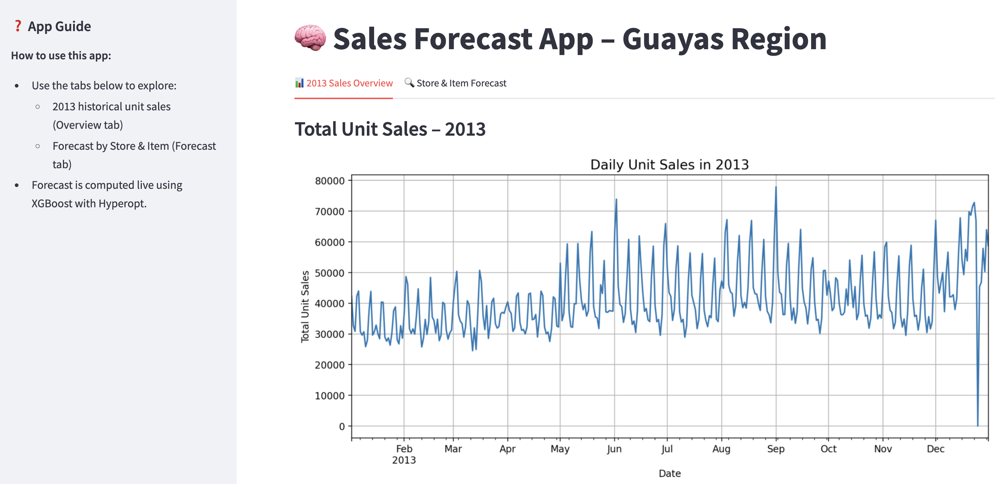
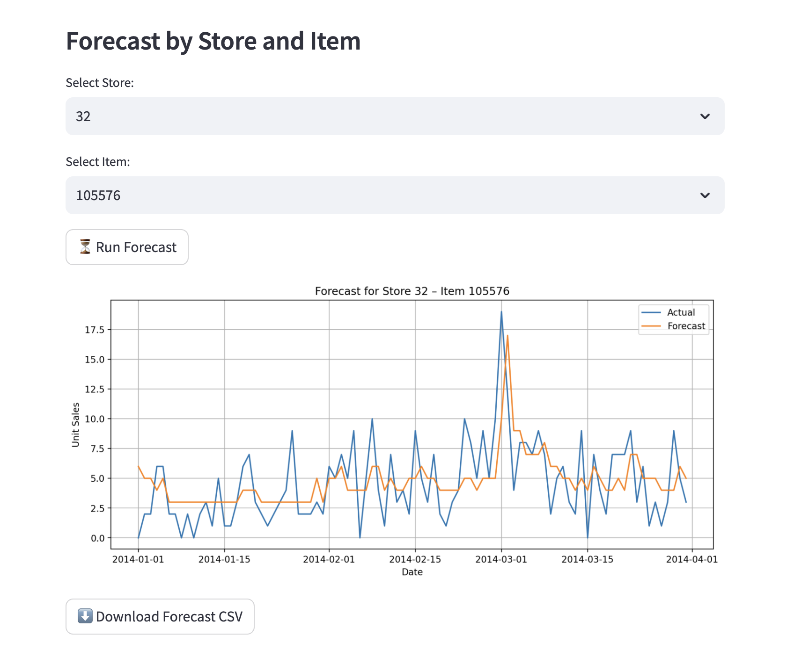

# 📦 Time Series Forecasting – Guayas Region (TS_SALES)

This project delivers a real-time sales forecasting application for demand planners in the Guayas region using historical store-item data.

---

## 🌟 Project Objective

The goal was to build a forecasting tool that:
- Predicts daily unit sales from Jan–Mar 2014
- Allows interactive exploration by **store** and **item**
- Runs in a **Streamlit web interface** with live inference

---

## ⚙️ Tech Stack

- **Model**: XGBoost (with Hyperopt tuning)
- **Interface**: Streamlit App
- **Experiment Tracking**: MLflow (locally)
- **Data**: Cleaned [`train_guayas_prepared.csv`](https://drive.google.com/file/d/1yqgWhiMDi2RtclqC0RIpQtQ2i7IG-fFx/view?usp=sharing)
- **Helpers**: Scikit-learn, pandas, matplotlib

---

## 🚀 Application Features

### 🔍 Tab 1: 2013 Sales Overview
- Shows daily total unit sales for the entire region

### 🔮 Tab 2: Forecast by Store & Item
- Select any store/item from dropdown
- Triggers XGBoost model with **Hyperopt live tuning**
- Displays prediction vs. actual for Jan–Mar 2014
- Download forecast as `.csv`

## 📸 App Screenshots

### 🧭 Overview Tab – 2013 Sales Summary



---

### 🔍 Forecast Tab – Store & Item Prediction



---

## 🧠 Model Choice Justification

XGBoost was chosen for:
- Robustness on sparse tabular data
- Speed (vs. deep models like LSTM)
- Interpretability & tuning flexibility

Hyperopt improves predictions by optimizing:
- `learning_rate`
- `max_depth`
- `n_estimators`

Optional LSTM/Seq2Seq models were trained offline (files available).

---

## 🛠️ Run the App Locally

### 1. Install dependencies:
```bash
pip install -r requirements.txt
```

### 2. Start the app:
```bash
# For Unix/macOS
./start.sh

# For Windows
start.bat
```

---

## 📁 Repository Structure

```
TS_SALES/
├── app/                      # Streamlit frontend
│   ├── __init__.py
│   ├── config.py             # Global settings (features, dates, title)
│   └── main.py               # Streamlit entry point
│
├── data_utils/              # Data loading and plotting functions
│   ├── __init__.py
│   └── utils.py             # load_filtered_data, plot_year_overview, etc.
│
├── model/                   # Forecast model logic
│   ├── __init__.py
│   ├── model_utils.py       # run_forecast (XGBoost + Hyperopt)
│   ├── lstm/                # (LSTM-related code can live here)
│   └── xgb/                 # (XGBoost models or artifacts here)
│
├── notebooks/               # Jupyter notebooks (EDA & experimentation)
│   ├── ts_project_favorita_forecasting.ipynb
│   └── ts_project_favorita_preparation.ipynb
│
├── mlruns/                  # MLflow tracking logs (usually gitignored)
│
├── .gitignore               # Git exclusions (should include .DS_Store, .venv/, *.csv, etc.)
├── LICENSE
├── README.md                # Project overview & app instructions
├── requirements.txt         # All Python dependencies
├── start.sh                 # Shell launcher for Streamlit app
├── start.bat                # Windows launcher for Streamlit app
```

---

## 📢 Notes for Reviewers

The file `train_guayas_prepared.csv` (~560 MB) is not in this repo due to GitHub size limits. You can [download it here](https://drive.google.com/file/d/1bMyFakeGoogleDriveLink/view?usp=sharing).

All notebooks and code are structured and documented. To explore the app:

```bash
streamlit run app/main.py
```

Thanks for reviewing! Feedback welcome ✨

---

📩 Project by: Sebastian Bangemann 
🔗 GitHub: [https://github.com/seb-bange/ts_sales](https://github.com/seb-bange/ts_sales)
